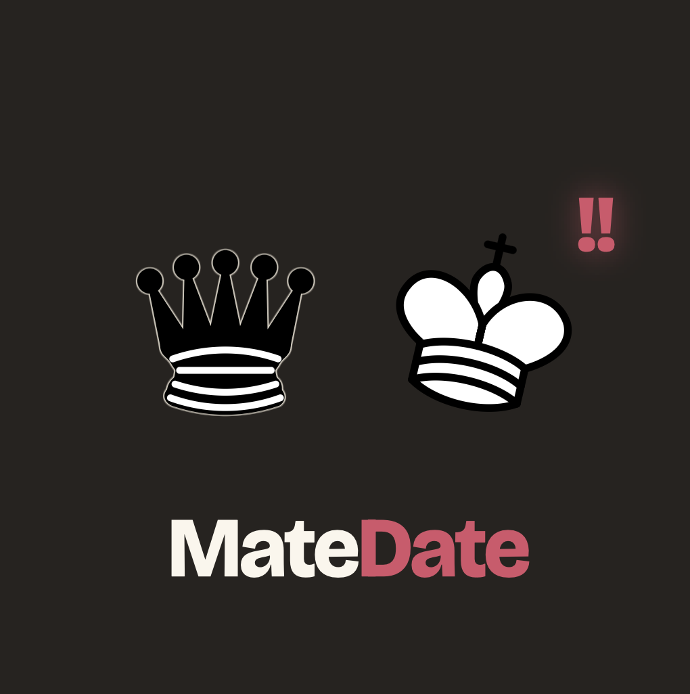
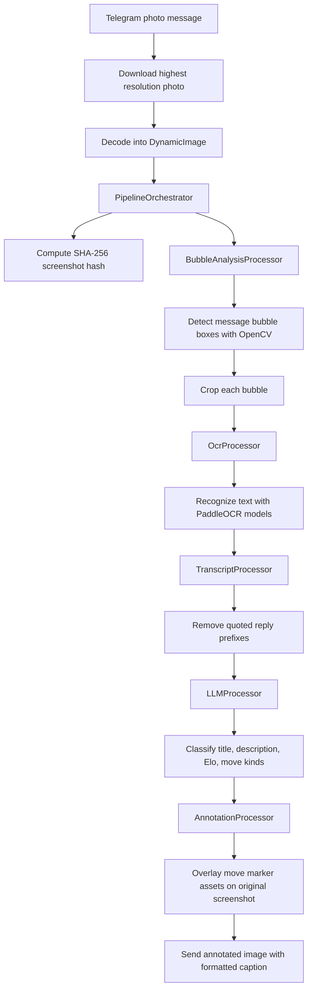

# `matedate`

> "The best move is the one you didn't make at 3 AM."  
> Bobby Fischer

`matedate` is a Telegram bot that reads chat screenshots, detects message bubbles, recognizes text, classifies the conversation as chess-like dating moves, and returns an annotated screenshot with a short analysis.


## File Overview

```text
 -- src/
    |-- main.rs                        # Telegram bot entrypoint, startup wiring, and response sending
    |-- db.rs                          # SQLite pool setup, pragmas, and embedded migrations
    |-- db/
    |   |-- models.rs                  # Diesel models and insert views
    |   -- schema.rs                  # Diesel table schema declarations
    |-- pipeline/
        |-- mod.rs                     # Shared pipeline types, enums, and module declarations
        |-- orchestrator.rs            # Top-level Kameo actor supervising all stages
        |-- bubble_analysis.rs         # OpenCV chat bubble detection and crop extraction
        |-- ocr.rs                     # OCR model initialization and text recognition
        |-- transcript_processing.rs   # Transcript cleanup and quoted-reply removal
        |-- llm_classification.rs      # LLM title/description/Elo/move classification
        |-- annotation.rs              # Overlay renderer for move marker assets
        |-- image_utils.rs             # Shared image-analysis helpers
        |-- PROMPT.txt                 # LLM prompt for conversation classification
```

## Technical Notes

### Why Kameo

The bot uses `kameo` actors to keep the image-analysis pipeline explicit and isolated. Each pipeline stage has a narrow `analyze` message contract, so the Telegram handler only talks to `PipelineOrchestrator` instead of coordinating bubble detection, OCR, transcript cleanup, LLM classification, and annotation directly.

This matters because several stages are blocking or CPU-heavy. Bubble detection uses OpenCV, OCR runs local model inference, and annotation touches image buffers. Those actors are supervised by `PipelineOrchestrator` and spawned on dedicated threads, so expensive work does not block the async Telegram runtime. If a stage actor dies, Kameo supervision restarts it under the orchestrator instead of requiring the whole bot process to recover manually.

### Why PaddleOCR

The OCR stage uses PaddleOCR models through `ocr-rs` because chat screenshots are not plain document scans. They contain small UI text, mixed languages, timestamps, emojis, quoted snippets, and compressed image artifacts. PaddleOCR gives a practical detection-plus-recognition pipeline for this kind of dense screenshot text.

The bot initializes English and Cyrillic recognition models and runs both paths for each detected message crop. It then picks the more plausible transcript by script-weighted scoring. This is intentionally local and deterministic at the OCR layer: the LLM receives already-cleaned text instead of being asked to infer text from pixels.

### How Bubble Detection Works

Bubble detection is implemented with OpenCV and image heuristics rather than template matching for one chat app. The detector first estimates the dominant background color, then builds masks for regions that differ from the background and for saturated UI-colored regions. It also extracts edge-based candidates with grayscale blur, Canny edges, morphological closing, and dilation.

Candidate rectangles from those masks are expanded, filtered by size, area, aspect ratio, and left/right alignment, then overlapping boxes are merged. This makes the detector tolerant of scribbles or censorship over part of a message: the bubble can still be recovered from remaining color/edge structure. Each accepted rectangle is classified as `They` or `Us` based on horizontal position, and the crop is passed to OCR.

## Image Processing Pipeline


